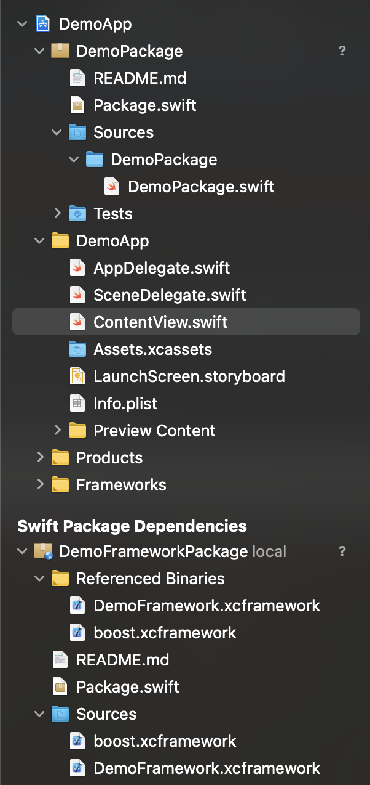

# How to use Swift package manager to manage your own frameworks & 3rd party binary frameworks dependency

## Project Overview


*  DemoFramework：Custom framework project to build our own framework (Use fastlane to build XCFramework)
* DemoFrameworkPackage：Custom Swift Package to import DemoFramework and 3rd party frameworks (boost.xcframework for example)
* DemoPackage：Custom Swift Package to manage multiple dependency
* DemoApp：App project to import one single DemoPackage, it will import all dependency automatically


## How to build XCFramework
[How to build XCFramework](https://github.com/bielikb/xcframeworks)


### Using xcodebuild
#### Build framework for iOS arm64
```
xcodebuild archive \
-scheme DemoFramework \
-destination "generic/platform=iOS" \
-archivePath ../output/DemoFramework \
SKIP_INSTALL=NO \
BUILD_LIBRARY_FOR_DISTRIBUTION=YES
```

#### Build framework for iOS Simulator arm64 & x86_64
```
xcodebuild archive \
-scheme DemoFramework \
-destination "generic/platform=iOS Simulator" \
-archivePath ../output/DemoFramework-Sim \
SKIP_INSTALL=NO \
BUILD_LIBRARY_FOR_DISTRIBUTION=YES
```
#### Create XCFramwork
```
xcodebuild -create-xcframework \
-framework ./DemoFramework.xcarchive/Products/Library/Frameworks/DemoFramework.framework \
-framework ./DemoFramework-Sim.xcarchive/Products/Library/Frameworks/DemoFramework.framework \
-output ./DemoFramework.xcframework
```

### Using Fastlane

[Setup Fastlane](https://docs.fastlane.tools/getting-started/ios/setup/)

[Using create_xcframework plug-in](https://github.com/bielikb/xcframeworks#create-xcframework-using-fastlane-plugin)

[Fastlane create_xcframework plug-in](https://github.com/bielikb/fastlane-plugin-create_xcframework)


## How to use Swift package


[A Step by Step Guide on how to Create a XCFramework and Distribute it as a Swift package](https://www.appcoda.com/xcframework/)

[A Practical Approach on Using Swift Package Manager in Xcode](https://www.appcoda.com/swift-package-xcode/)

[Distributing Binary Frameworks as Swift Packages](https://developer.apple.com/documentation/swift_packages/distributing_binary_frameworks_as_swift_packages)
